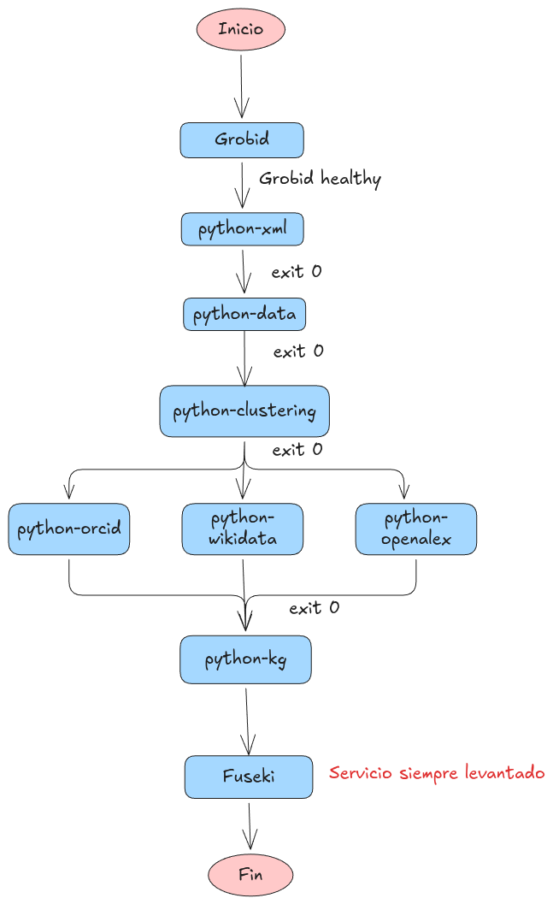

# Docker Compose:

En esta carpeta se sitúa el orquestador de los diferentes contenedores que componen la infraestructura del sistema de extracción y generación del grafo de conocimiento.

## Servicios

| Servicio | Imagen base | Función |
|---|---|---|
| `grobid` | `grobid/grobid:0.8.2-full` | Extrae información estructurada de documentos científicos mediante API REST |
| `python-xml` | `python:3.11-slim` | Llama a la API de Grobid para generar un XML TEI por documento |
| `python-data` | `python:3.11-slim` | Parsea los XML generados y ejecuta NER sobre los *acknowledgments* |
| `python-clustering` | `python:3.11-slim` | Categoriza los documentos por *topics* |
| `python-orcid` | `python:3.11-slim` | Consulta la API de ORCID para obtener datos de investigadores por su OrcidID |
| `python-wikidata` | `python:3.11-slim` | Consulta Wikidata Scholarly vía SPARQL para extraer metadatos de papers |
| `python-openalex` | `python:3.11-slim` | Consulta la API de OpenAlex para obtener información de autores y publicaciones |
| `python-kg` | `python:3.11-slim` | Genera el grafo de conocimiento a partir de todos los datos anteriores |
| `fuseki` | `stain/jena-fuseki:5.1.0` | Levanta un endpoint SPARQL/HTTP para consultar el grafo de conocimiento |


## Flujo de ejecución

Las dependencias entre servicios determinan un orden de ejecución estricto. Cada servicio espera a que el anterior haya completado correctamente (`exit 0`) antes de arrancar, con la excepción de `grobid`, que debe estar *healthy*.

Los tres servicios `python-orcid`, `python-wikidata` y `python-openalex` se ejecutan **en paralelo** una vez que `python-clustering` termina.

`fuseki` arranca de forma independiente al resto del pipeline y permanece activo con `restart: unless-stopped`, listo para recibir el grafo de conocimiento generado por `python-kg`.




## Variables de entorno

El proyecto requiere un fichero `.env` en la raíz del repositorio con las siguientes variables:

### Puertos

| Variable | Descripción | Ejemplo |
|---|---|---|
| `GROBID_EXTERNAL_PORT` | Puerto externo para acceder a la API de Grobid desde el host | `8070` |
| `FUSEKI_PORT` | Puerto externo para acceder al endpoint SPARQL de Fuseki | `3030` |


### Credenciales ORCID

Para obtener estas credenciales es necesario registrar una aplicación en [https://orcid.org/developer-tools](https://orcid.org/developer-tools).

| Variable | Descripción |
|---|---|
| `ORCID_CLIENT_ID` | Client ID de la aplicación registrada en ORCID |
| `ORCID_CLIENT_SECRET` | Client Secret de la aplicación registrada en ORCID |
| `CLIENT_URL` | URL de callback/redirect de la aplicación ORCID (p.ej. `https://pub.orcid.org/`) |

### Fuseki

| Variable | Descripción | Ejemplo |
|---|---|---|
| `FUSEKI_PASSWORD` | Contraseña del administrador del servidor Fuseki | `admin` |

### Ejemplo de `.env`

```dotenv
# Puertos
GROBID_EXTERNAL_PORT=8070
FUSEKI_PORT=3030

# ORCID
ORCID_CLIENT_ID=APP-XXXXXXXXXXXXXXXX
ORCID_CLIENT_SECRET=xxxxxxxx-xxxx-xxxx-xxxx-xxxxxxxxxxxx
CLIENT_URL=https://localhost

# Fuseki
FUSEKI_PASSWORD=admin

# OpenAlex
OPENALEX_EMAIL=xxxxxx@xxxx.xxxx
```
## Red y volúmenes

### Red interna

Todos los servicios se comunican a través de la red bridge `net_ia_practica_2`. Esto permite que los contenedores se referencien entre sí por su nombre de servicio con el DNS de docker.

### Volúmenes de datos

Los datos fluyen entre servicios mediante **bind mounts** en directorios locales:

```
./pygrobid/input/          → input de  los PDFs      
./pygrobid/output/         → output de python-xml      / input de python-data
./pyextractdata/output/    → output de python-data     / input de python-clustering, python-orcid, python-wikidata, python-openalex, python-kg
./pyclustering/output/     → output de python-clustering / input de python-kg
./pyorcid/output/          → output de python-orcid   / input de python-kg
./pywikidata/output/       → output de python-wikidata / input de python-kg
./pyopenalex/output/       → output de python-openalex / input de python-kg
./pykg/output/             → output de python-kg (grafo final)
./ontology/                → ontología compartida con python-kg
fuseki-data                → gestionado por docker.
```


## Requisitos previos

- **Docker** >= 29.4.0 y **Docker Compose** >= Docker Compose version v5.1.3
- GPU NVIDIA con drivers instalados y `nvidia-container-toolkit` configurado (requerido por Grobid para aceleración). Si no dispones de GPU, elimina el bloque `deploy.resources.reservations` del servicio `grobid`.
- Fichero `.env` correctamente configurado (ver sección anterior).
- Documentos PDF de entrada colocados en `./pygrobid/input/`.

## Ejecución

```bash
# Levantar todo el pipeline
docker compose up
# Ejecutar en segundo plano
docker compose up -d
# Ver logs de un servicio concreto
docker compose logs -f python-kg
# Detener y eliminar contenedores
docker compose down
# Detener, eliminar contenedores y volúmenes
docker compose down -v
```
Una vez ha terminado el flujo de los contenedores se debe subir el knowledge graph a Fuseki. Los pasos están explicados en 

En caso de querer ejecución fuera de contenedores docker seguir los readmes de ejecución de cada uno de los diferentes dockers.


## Servicios expuestos:

| Servicio | URL | Notas |
|---|---|---|
| Grobid | `http://localhost:${GROBID_EXTERNAL_PORT}` | Panel web + API REST |
| Grobid API | `http://localhost:${GROBID_EXTERNAL_PORT}/api/processFulltextDocument` | Endpoint de procesamiento |
| Fuseki | `http://localhost:${FUSEKI_PORT}` | Panel de administración |
| Fuseki SPARQL | `http://localhost:${FUSEKI_PORT}/dataset/sparql` | Endpoint SPARQL |


# Más información:
Se puede encontrar más información en cada uno de los README.md de cada carpeta de ejecución. 
