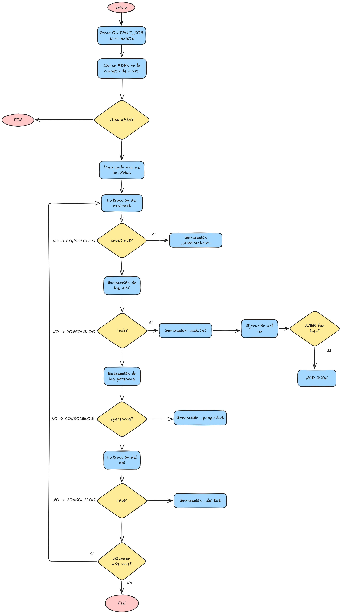

# PyExtractData

Este módulo recibe como input los XML generados por `pygrobid` y extrae la información de cada paper. Adicionalmente, ejecuta un proceso de Named Entity Recognition al acknowledgments.


## Flujo de ejecución:



Cada extracción es autónoma e independiente: si una falla para un documento concreto, se notifica por consola y el proceso continúa con las demás extracciones del mismo fichero.

## Name Entity Recognition (NER)
Para la extracción de entidades nombradas de la sección de agradecimientos 
de los papers se ha utilizado el modelo 
**jean-baptiste/roberta-large-ner-english** de HuggingFace.

### Entidades detectadas
- **Personas** (PER): autores y colaboradores mencionados
- **Organizaciones** (ORG): instituciones y entidades financiadoras
- **Lugares** (LOC): países y regiones mencionados
- **IDs de proyectos**: códigos de financiación detectados mediante 
expresiones regulares 

### Decisiones de diseño
- Se filtran entidades con confianza inferior al 85%: Se filtran entidades con confianza inferior al 85% (0.85) para evitar 
falsos positivos. Si fuera más alto, el modelo descartaría muchas entindades volviéndose demasiado estricto; y por el contrario, si es muy bajo, filtra entidades dudosas.
- Se eliminan acrónimos duplicados.
- Los IDs de proyectos no son detectados por el modelo de forma nativa, 
por lo que se añadió un extractor basado en expresiones regulares. Es posible que no todos los tipos de id sean reconocidos. 

### Modelos evaluados
Se evaluaron cuatro modelos antes de seleccionar el definitivo:

| Modelo | Tamaño | Resultado |
|--------|--------|-----------|
| `jean-baptiste/roberta-large-ner-english` | ~1.4GB | Mejor resultado global |
| `dslim/bert-base-NER` | ~400MB | Bueno con org. largas, falla con tokens complejos |
| `dslim/bert-large-cased-finetuned-conll03-english` | ~1.2GB | Fragmentación de tokens |
| `elastic/distilbert-base-uncased-finetuned-conll03-english` | ~250MB | Peor resultado global |

### Salida
El resultado se guarda en `output/knowledge_graph.ttl` en formato RDF/Turtle,
con las siguientes relaciones:
- `ex:acknowledges` → paper hacia persona u organización
- `ex:hasProject` → paper hacia ID de proyecto

El KG también puede exportarse en formato **JSON-LD** cambiando el parámetro 
`format` en `save_kg.py`:
```python
# Turtle 
g.serialize(output_path, format="turtle")

# JSON-LD
g.serialize(output_path, format="json-ld")
```
El contenido es equivalente en ambos formatos, solo cambia la representación. En el repositorio, está con formato json. 

### Ejecución NER:
Una vez se tenga el entorno con las dependencias iremos a la carpeta `./python-scripts` y ejecutaremos:
```bash
cd ./python-scripts/
python main.py 
```
### Evaluación del modelo NER

Para evaluar el rendimiento del modelo se ha creado un corpus de validación 
con las secciones de agradecimientos de 6 papers anotadas manualmente.

#### Corpus de validación

| Paper | Organizaciones | Lugares | IDs de proyecto |
|-------|---------------|---------|-----------------|
| paper0 | 1 | 0 | 0 |
| paper2 | 1 | 0 | 1 |
| paper3 | 2 | 0 | 0 |
| paper5 | 2 | 1 | 2 |
| paper7 | 0 | 0 | 0 |
| paper9 | 1 | 0 | 0 |

#### Resultados

| Entidad | Precisión | Recall | F1 |
|---------|-----------|--------|----|
| ORG | 0.75 | 0.86 | 0.80 |
| PER | 0 | 0 | 0 |
| LOC | 1.0 | 1.0 | 1.0 |
| PROJ | 1.0 | 1.0 | 1.0 |

#### Ejecución de la evaluación
En el archivo docker/pyextract/python-scripts/test/evaluate_ner.py, se debe completar el golden standard y rellenar los agradecimientos. 
```cmd
cd docker/pyextractdata/python-scripts
python tests/evaluate_ner.py
```
## Variables de entorno:

| Variable | Descripción | Valor por defecto |
|---|---|---|
| `INPUT_DIR` | Directorio con los XML de entrada | `/input` |
| `OUTPUT_DIR` | Directorio donde se guardan los ficheros de salida | `/output` |


## Volúmenes:

| Ruta en el contenedor | Descripción |
|---|---|
| `/input` | XML generados por `pygrobid` |
| `/output` | Ficheros extraídos y grafo de conocimiento |


## Ficheros de salida:

Por cada XML de entrada se generan hasta cuatro ficheros de texto y, al finalizar el loop, un fichero JSON global:

| Fichero | Contenido |
|---|---|
| `<paper>_abstract.txt` | Texto del abstract |
| `<paper>_ack.txt` | Texto de los agradecimientos |
| `<paper>_people.txt` | Autores y personas del documento en formato JSON |
| `<paper>_doi.txt` | Título y DOI en formato JSON |


## Ejecución en nativo y test:

### Ejecución nativa:
En caso de querer la ejecución en nativo se deben establecer diferentes variables de entorno (p.e. con un export). Además de instalar los requirements presentes en `./requirements.txt`.
```bash
# Creación del entorno:
python -m venv .venv
# Activación del entorno:
source .venv/bin/activate
# Instalación de los requirements:
pip install -r requirements.txt
# Movimiento a la carpeta del main
cd ./python-scripts/
# Creación de variables de entorno:
export INPUT_DIR=../../pygrobid/output
export OUTPUT_DIR=../output
python main.py
# En caso de tener error de CUDA OUT OF MEMORY:
CUDA_VISIBLE_DEVICES="" python main.py
```
| Ruta en el contenedor | Descripción |
|---|---|
| `INPUT_DIR` | Directorio con los XML a procesar |
| `OUTPUT_DIR` | Directorio donde se guardan los output generados |
### Ejecución test:
Una vez se tenga el entorno con las dependencias iremos a la carpeta `./python-scripts/tests/` y ejecutaremos:
```bash
cd ./python-scripts/tests/
pytest .
```
