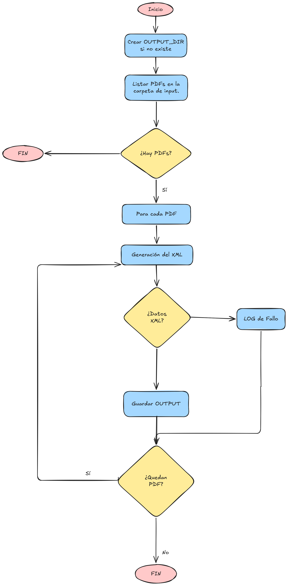

# PyGrobid

Este módulo se encarga de recibir documentos PDF como input y generar su representación en formato XML mediante llamadas a la API de Grobid.


## Flujo de ejecución



Para cada PDF encontrado en la ruta de input, el módulo realiza una llamada a Grobid y guarda el XML resultante en la ruta de output con el mismo nombre base que el fichero original.


## Variables de entorno

| Variable | Descripción | Valor por defecto |
|---|---|---|
| `GROBID_URL` | URL del endpoint de Grobid (definida en el docker-compose) | `http://grobid:8070/api/processFulltextDocument` |


## Rutas necesarias:

| Ruta en el contenedor | Descripción |
|---|---|
| `/input` | Directorio con los PDFs a procesar |
| `/output` | Directorio donde se guardan los XML generados |


## Comportamiento:

- Si no se encuentran ficheros `.pdf` en `/input`, el proceso termina sin error y lo notifica por consola.
- Si Grobid no puede procesar un documento concreto, se notifica el fallo por consola y se continúa con el siguiente PDF sin detener el pipeline.
- El directorio `/output` se crea automáticamente si no existe.

## Ejecución en nativo: 
En caso de querer la ejecución en nativo se deben establecer diferentes variables de entorno (p.e. con un export). Además de instalar los requirements presentes en `./requirements.txt`.
```bash
# Creación del entorno:
python -m venv .venv
# Activación del entorno:
source .venv/bin/activate
# Instalación de los requirements:
pip install -r requirements.txt
# Movimiento a la carpeta del main
cd ./python-scripts/
# Creación de variables de entorno:
export GROBID_URL=http://192.168.68.68:8071/api/processFulltextDocument
export INPUT_DIR=../input
export OUTPUT_DIR=../output
python main.py
```
| Ruta en el contenedor | Descripción |
|---|---|
| `INPUT_DIR` | Directorio con los PDFs a procesar |
| `OUTPUT_DIR` | Directorio donde se guardan los XML generados |
| `GROBID_URL` | Dirección de Grobid donde se hacen las peticiones (p.e. `http://midns:8070/api/processFulltextDocument` ) |

