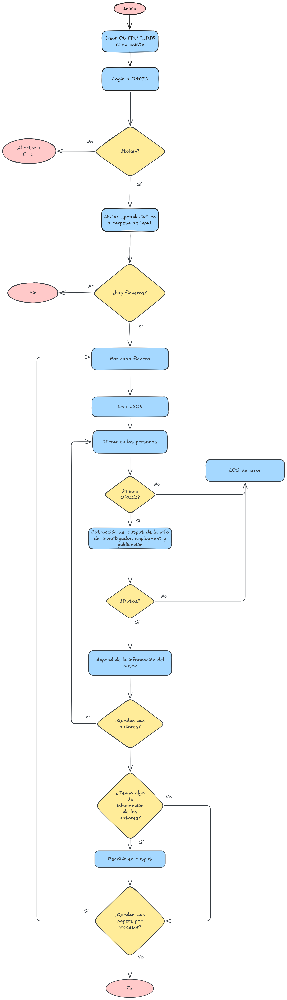

# PyOrcid

Este módulo consulta la **API de ORCID** para obtener información detallada de los investigadores identificados en cada paper. Toma como input los ficheros `_people.txt` generados por `pyextractdata` y produce un único JSON por paper con todos los autores que tengan ORCID y datos disponibles.


## Flujo de ejecución



Si el login falla, el proceso aborta completamente. Solo se incluyen en el JSON los autores con ORCID y con datos devueltos por la API. Si ningún autor del paper cumple esta condición, no se genera fichero de salida.


## Variables de entorno

| Variable | Descripción | Valor por defecto |
|---|---|---|
| `INPUT_DIR` | Directorio con los ficheros `_people.txt` de entrada | `/input` |
| `OUTPUT_DIR` | Directorio donde se guardan los resultados | `/output` |
| `ORCID_CLIENT_ID` | Client ID de la aplicación registrada en ORCID | — |
| `ORCID_CLIENT_SECRET` | Client Secret de la aplicación registrada en ORCID | — |
| `CLIENT_URL` | URL completa de la API de ORCID puede ser `production` o `sandbox` | — |

> Las credenciales `ORCID_CLIENT_ID`, `ORCID_CLIENT_SECRET` y `CLIENT_URL` son obligatorias. Sin ellas el login fallará y el pipeline se abortará.


## Volúmenes

| Ruta en el contenedor | Descripción |
|---|---|
| `/input` | Ficheros `_people.txt` generados por `pyextractdata` |
| `/output` | JSONs con la información de cada investigador extraída de ORCID |


## Ficheros de entrada y salida

| Entrada | Salida |
|---|---|
| `<paper>_people.txt` | `<paper>_processed_orcid.json` |

El fichero de entrada es un array JSON con objetos `{ "orcid": "…", "nombre_completo": "…" }`. Se genera **un único fichero de salida por paper**, solo si al menos un autor tiene ORCID con datos disponibles.

### Estructura del JSON de salida

```json
{
    "autores": [
        {
            "nombre_completo": "nombre apellido",
            "orcid": "0000-0000-0000-0000",
            "investigador": { ... },
            "empleo": [ { ... }, ... ],
            "publicaciones": [ { ... }, ... ]
        }
    ]
}
```


## Comportamiento ante errores

| Situación | Comportamiento |
|---|---|
| Login fallido | Aborta el pipeline completamente |
| No hay ficheros `_people.txt` en `/input` | Termina sin error, notifica por consola |
| Fichero JSON malformado | Log del error, continúa con el siguiente fichero |
| Investigador sin ORCID | Log informativo, se omite del JSON de salida |
| API de ORCID no devuelve datos | Log informativo, se omite del JSON de salida |
| Ningún autor con datos en el paper | No se genera fichero de salida, continúa con el siguiente |
| Cualquier otra excepción al leer el fichero | Log del error, continúa con el siguiente fichero |


## Ejecución en nativo y test:

### Ejecución nativa:
En caso de querer la ejecución en nativo se deben establecer diferentes variables de entorno (p.e. con un export). Además de instalar los requirements presentes en `./requirements.txt`.
```bash
# Creación del entorno:
python -m venv .venv
# Activación del entorno:
source .venv/bin/activate
# Instalación de los requirements:
pip install -r requirements.txt
# Movimiento a la carpeta del main
cd ./python-scripts/
# Creación de variables de entorno:
export INPUT_DIR=../../pyextractdata/output
export OUTPUT_DIR=../output
python main.py
```
| Ruta en el contenedor | Descripción |
|---|---|
| `INPUT_DIR` | Directorio con los _doi.txt a procesar |
| `OUTPUT_DIR` | Directorio donde se guardan los output generados |
| `CLIENT_ID` | Id del cliente de la API de ORCID |
| `CLIENT_SECRET` | Token del cliente de ORCID |
| `CLIENT_URL` | URL donde se ataca para obtener la información |
### Ejecución test:
Al igual que con la ejecución normal debemos establecer el valor de las variables de entorno. 
Una vez se tenga el entorno con las dependencias iremos a la carpeta `./python-scripts/tests/` y ejecutaremos:
```bash
cd ./python-scripts/tests/
pytest .
```

