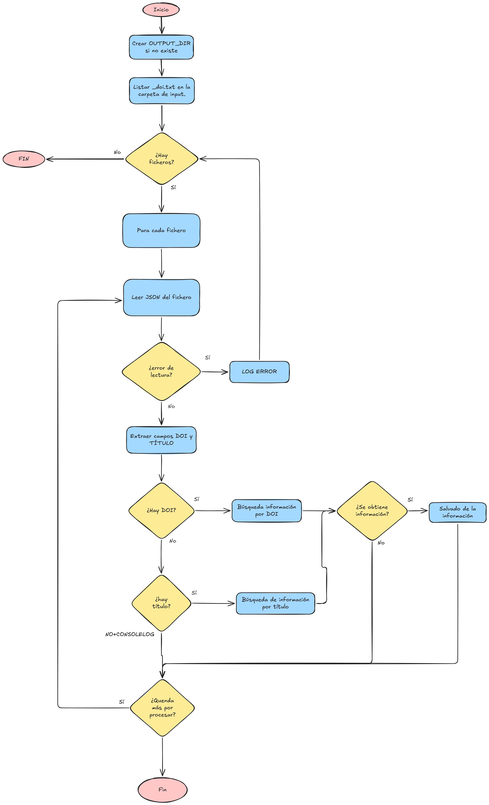

# PyWikidata

Este módulo consulta Wikidata Scholarly vía SPARQL para extraer metadatos de papers científicos. Toma como input los ficheros `_doi.txt` generados por `pyextractdata` y produce un JSON con la información obtenida de Wikidata por cada documento.


## Flujo de ejecución



La búsqueda prioriza el **DOI** sobre el título. Solo se recurre al título si el DOI no está disponible. Si ninguno de los dos existe, el fichero se omite.


## Variables de entorno

| Variable | Descripción | Valor por defecto |
|---|---|---|
| `INPUT_DIR` | Directorio con los ficheros `_doi.txt` de entrada | `/input` |
| `OUTPUT_DIR` | Directorio donde se guardan los resultados | `/output` |


## Volúmenes

| Ruta en el contenedor | Descripción |
|---|---|
| `/input` | Ficheros `_doi.txt` generados por `pyextractdata` |
| `/output` | JSONs con la información extraída de Wikidata |


## Ficheros de entrada y salida

| Entrada | Salida |
|---|---|
| `<paper>_doi.txt` | `<paper>_processed_wikidata.json` |

El fichero de entrada es un JSON con los campos `titulo` y `doi`. El fichero de salida solo se escribe si Wikidata devuelve resultados.


## Comportamiento ante errores

| Situación | Comportamiento |
|---|---|
| No hay ficheros `_doi.txt` en `/input` | Termina sin error, notifica por consola |
| Fichero JSON malformado o no encontrado | Log del error, continúa con el siguiente fichero |
| Sin DOI ni título | Log informativo, continúa con el siguiente fichero |
| Wikidata no devuelve resultados | No se escribe fichero de salida, continúa |


## Ejecución en nativo y test:

### Ejecución nativa:
En caso de querer la ejecución en nativo se deben establecer diferentes variables de entorno (p.e. con un export). Además de instalar los requirements presentes en `./requirements.txt`.
```bash
# Creación del entorno:
python -m venv .venv
# Activación del entorno:
source .venv/bin/activate
# Instalación de los requirements:
pip install -r requirements.txt
# Movimiento a la carpeta del main
cd ./python-scripts/
# Creación de variables de entorno:
export INPUT_DIR=../../pyextractdata/output
export OUTPUT_DIR=../output
python main.py
```
| Ruta en el contenedor | Descripción |
|---|---|
| `INPUT_DIR` | Directorio con los _doi.txt a procesar |
| `OUTPUT_DIR` | Directorio donde se guardan los output generados |
### Ejecución test:
Una vez se tenga el entorno con las dependencias iremos a la carpeta `./python-scripts/tests/` y ejecutaremos:
```bash
cd ./python-scripts/tests/
pytest .
```
